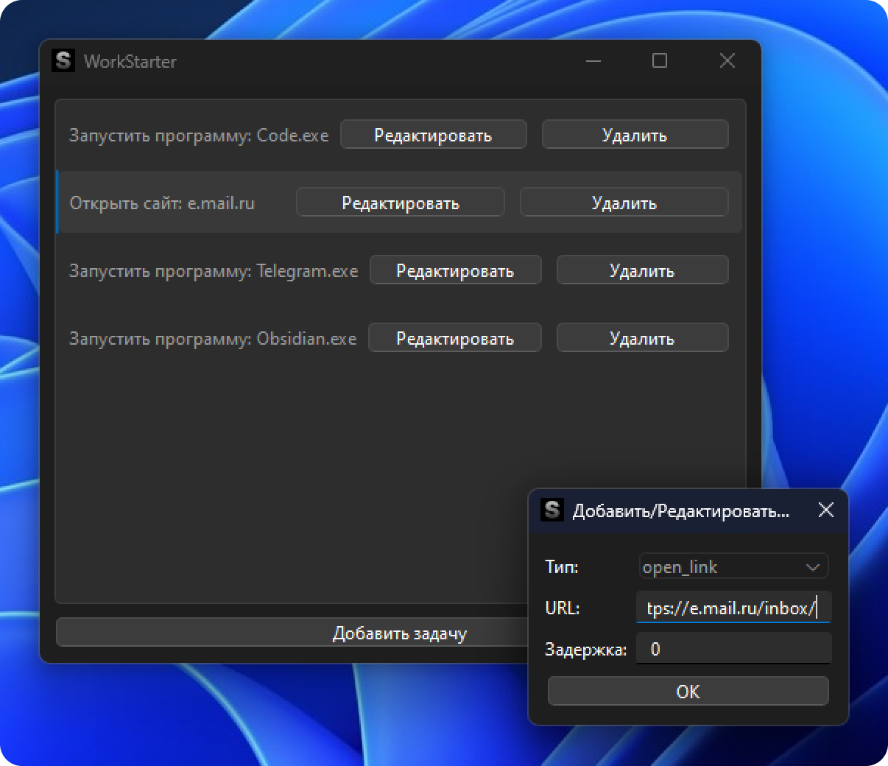
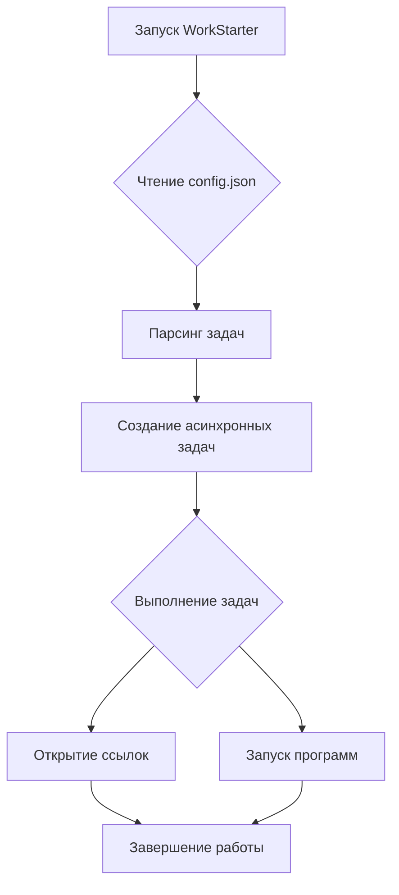

# 🚀 WorkStarter

**💼 Простая утилита для автоматического запуска программ и открытия сайтов при старте твоего ПК**

<div align="center">




</div>

## 📥 Скачать

[⬇️ Скачать последнюю версию WorkStarter](https://github.com/ivanoskov/workstarter/releases/latest/download/WorkStarter_Setup.exe)

## ✨ Возможности

- 🖥️ Автоматический запуск программ
- 🌐 Открытие веб-сайтов
- ⏱️ Настраиваемые задержки для каждой задачи
- 🎨 Графический интерфейс для управления задачами
- 🔧 Настройка через JSON-конфигурацию
- 📁 Хранение конфигурации в пользовательской директории
- 📝 Логирование во временную директорию

## 🛠️ Установка

1. [Скачайте последнюю версию WorkStarter](https://github.com/ivanoskov/workstarter/releases/latest/download/WorkStarter_Setup.exe).
2. Запустите скачанный файл `WorkStarter_Setup.exe`.
3. Следуйте инструкциям мастера установки.

После установки:
- Графический интерфейс WorkStarter будет доступен в меню "Пуск" Windows.
- Агент WorkStarter будет автоматически запускаться при старте системы.

## 🚀 Использование

1. Запустите "WorkStarter Configuration" из меню "Пуск" для настройки задач.
2. Добавьте нужные задачи через графический интерфейс.
3. WorkStarterAgent будет автоматически запускаться при старте системы и выполнять настроенные задачи.

## ⚙️ Конфигурация

WorkStarter хранит конфигурацию в файле `config.json` в пользовательской директории приложения. Вот пример структуры:

```json
{
  "tasks": [
    {
      "type": "open_link",
      "url": "https://www.example.com",
      "delay": 3
    },
    {
      "type": "open_program",
      "path": "C:\\Program Files\\Example\\example.exe",
      "delay": 5
    }
  ]
}
```

## 📊 Схема работы



## 📁 Расположение файлов

- Конфигурационный файл: `C:\Users\<Username>\AppData\Local\ivanoskov\WorkStarter\config.json`
- Лог-файл: `C:\Users\<Username>\AppData\Local\Temp\WorkStarter.log`

## 🤝 Вклад в проект

Если хочешь внести свой вклад в WorkStarter, буду рад твоей помощи:

- 🐛 Сообщай о найденных ошибках
- 💡 Предлагай новые функции
- 🔧 Отправляй пулл-реквесты

## 📄 Лицензия

Этот проект распространяется под лицензией MIT - подробности в файле [LICENSE](LICENSE).

## 🙏 Благодарности

- [PyQt6](https://www.riverbankcomputing.com/software/pyqt/) за инструменты для создания GUI
- [asyncio](https://docs.python.org/3/library/asyncio.html) за асинхронные возможности
- [appdirs](https://pypi.org/project/appdirs/) за управление директориями приложения

---

<div align="center">
  Создано с ❤️ by ivanoskov
</div>
